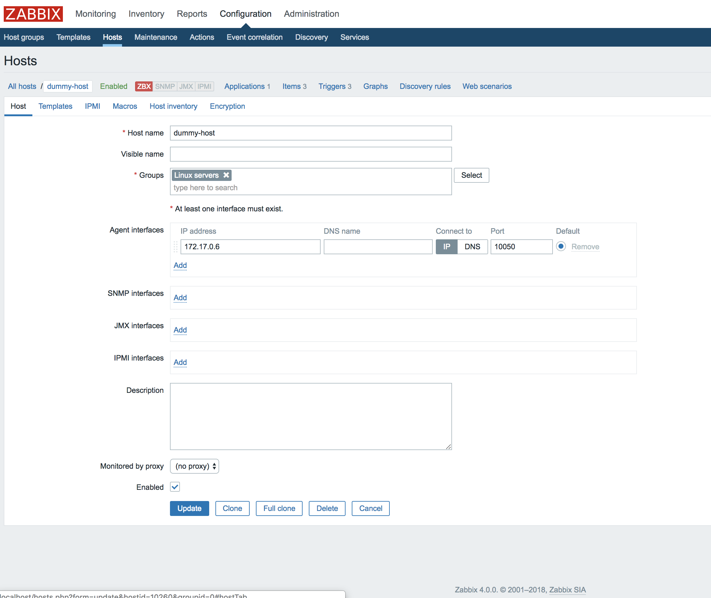
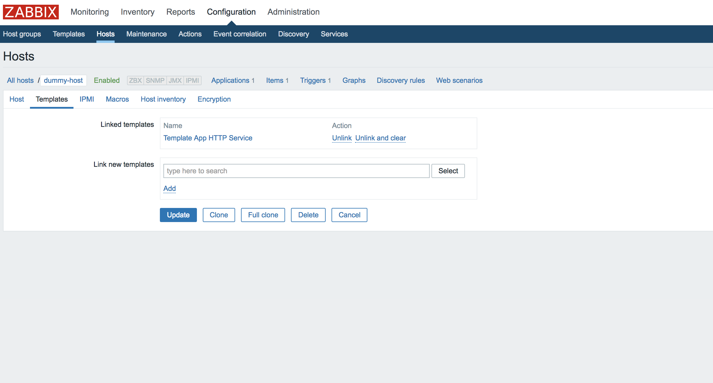
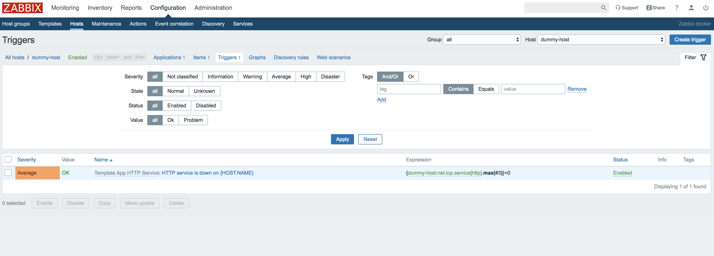

# Dev setup

### Zabbix server setup on docker
* Run `make build-zabbix-server` to spin up containers needed for Zabbix server to run on docker.
* Visit `http://localhost:80` to access Zabbix web interface. Username: `Admin`, password: `zabbix`

### Rundeck setup on docker
* Run `make build-rundeck` to spin up Rundeck container.
* Visit `http://localhost:4440/user/login` to access Rundeck web interface. Username: `admin`, password: `admin`

### Zabbix host setup on docker
* Run `make build-dummy-host` to spin up dummy Zabbix host container with Zabbix agent.
* Visit `http://localhost:8001` to access dummy host web interface.

### Add dummy host to Zabbix server for monitoring
Get the IP address of dummy host by running
```
docker inspect -f '{{range .NetworkSettings.Networks}}{{.IPAddress}}{{end}}' dummy-host
```

On [Zabbix web interface](http://localhost:80), information about configured hosts in Zabbix is available in Configuration → Hosts.
To add dummy host, click on Create host. This will present us with a host configuration form. Enter the following values.

Host name: dummy-host

Groups: Linux servers

Agent interfaces: dummy-host-IP-address-gotten-above leaving port as `10050`

Click on `Enabled` then update.



Still on Configuration → Hosts, click on `Templates`.

On the `Link new templates` field, Select `Template App HTTP Service`, click `add`, then `Update`.



### Verify dummy host set up
Still on Configuration → Hosts, click on `Triggers`.

Verify that the value of `Template App HTTP Service: HTTP service is down on {HOST.NAME}` trigger is `OK`



### Container management
* Start Zabbix server containers -->  `make start-zabbix-server`
* Stop Zabbix server containers --> `make stop-zabbix-server`

* Start Rundeck containers --> `make start-rundeck`
* Stop Rundeck containers --> `make stop-rundeck`

* Start Dummy host container --> `make start-dummy-host`
* Stop Dummy host container --> `make stop-dummy-host`

* Start all containers --> `make start-all`
* Stop all containers --> `make stop-all`
